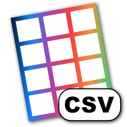

<p>
  
</p>

# Table Tool X

A simple CSV editor for macOS.

CSV is a common format for storing and exchanging tabular data, but not all CSV files are
made equal. Files can use different delimiters, character encodings, line endings, decimal
separators, headers, and quoting styles.

Table Tool X detects these details automatically and displays the file in a native table view.
It is a Swift continuation of Jakob Egger's original
[Table Tool](https://github.com/jakob/TableTool), designed to remain responsive when a file is
too large to keep entirely in memory.

## Usage

**Open files:** Table Tool X detects the delimiter, quote style, character encoding, line
endings, decimal separator, and header automatically. You can also set the format manually.

**Edit files:** Edit cells, rows, and columns in a native grid. Find, replace, filter, sort,
copy, paste, reorder, undo, and redo are supported.

**Convert files:** Export the full document or the visible filtered rows using a different
delimiter, encoding, quote style, line ending, or header setting.

## Development

Table Tool X requires macOS 14 or later, Xcode 16, and
[XcodeGen](https://github.com/yonaskolb/XcodeGen).

```sh
xcodegen generate
open TableToolX.xcodeproj
```

The Xcode project is generated from [project.yml](project.yml) and intentionally not committed.

The shared core can also be tested with Swift Package Manager:

```sh
swift test
```

If `xcode-select` points at the standalone Command Line Tools, prefix build commands with
`DEVELOPER_DIR=/Applications/Xcode.app/Contents/Developer`.

The normal test suite includes the original project's compatibility fixtures. Run the optional
generated-data performance test with:

```sh
TABLETOOLX_PERFORMANCE_MB=100 swift test --filter PerformanceTests
```

## Upstream attribution

Table Tool X is an independent clean Swift continuation of
[jakob/TableTool](https://github.com/jakob/TableTool), originally created by
[Sandro Peham](https://github.com/SandroPeham),
[Andreas Aigner](https://github.com/aigi), and
[Jakob Egger](https://github.com/jakob) and released under the MIT License.

The original Objective-C production sources are not compiled into Table Tool X. The new
implementation uses the original application's documented behavior and test cases as
compatibility references. When an upstream fixture is copied verbatim, it must remain
identified as such and covered by the original copyright notice in [LICENSE](LICENSE).

The Table Tool X app icon is a recolored adaptation of the original Table Tool icon. Its
geometry remains attributable to the original authors under the same MIT License; the color
treatment uses Table Tool X's Leme-derived brand palette.

Table Tool X is not endorsed by or affiliated with the original maintainers. It uses a new
bundle identifier, update feed, icon colorway, and release channel.

The fork retains the original tags through v1.2.1 and links them to Jakob Egger's upstream
release history. Table Tool X continues that sequence at v1.3.0 rather than restarting the
application's version history.

## Mission / Project Scope / Contributing

Table Tool X seeks to be a fast, simple editor for delimiter-separated text and nothing more.
Spreadsheet formatting, formulas, charts, databases, and cloud collaboration are outside the
project's scope.

Please open an [issue](https://github.com/leanderrj/TableToolX/issues) when something is broken
or a focused CSV-editing feature is missing. Contributions are welcome; see
[CONTRIBUTING.md](CONTRIBUTING.md).

Release history and maintainer instructions live in the
[changelog](docs/CHANGELOG.md) and [release guide](docs/RELEASING.md). Security issues should
follow [SECURITY.md](SECURITY.md).

## License

Table Tool X is distributed under the [MIT License](LICENSE).
